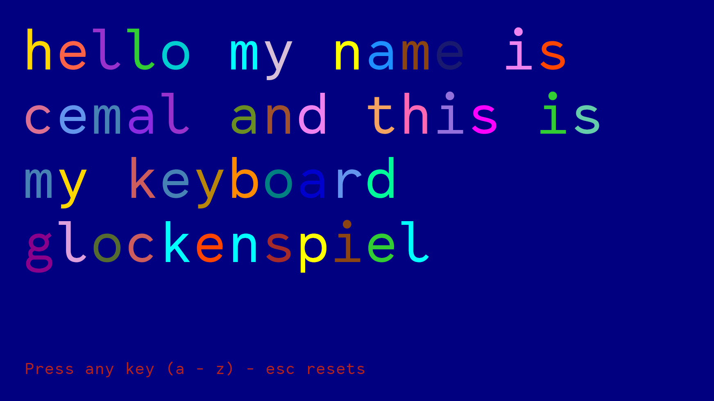
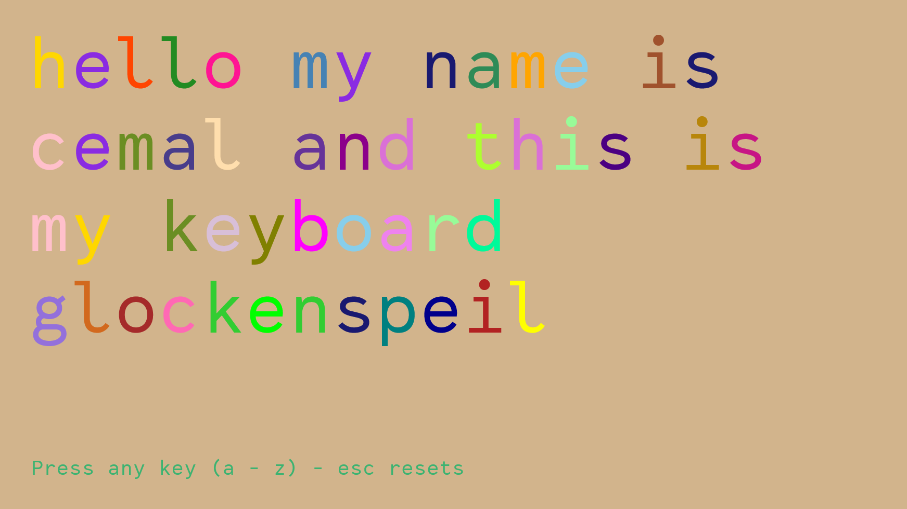
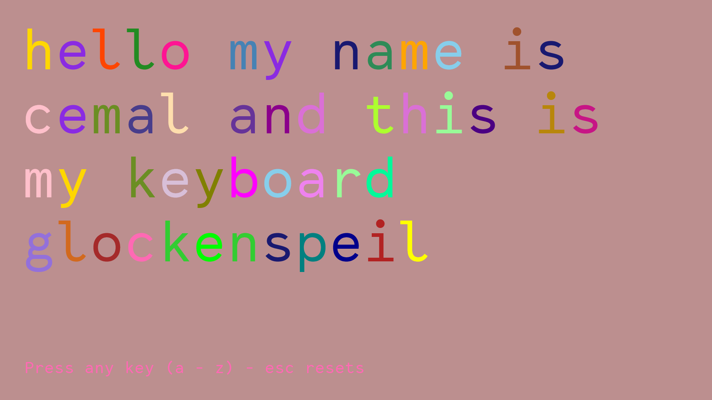

### Keyboard Glockenspiel 🎹

A project from **week 1** of the FAC 22 pre-apprenticeship. 

💾 See full pre-apprenticeship repository [here](https://github.com/cemalokten/fac-pre-apprenticeship). 

The keyboard glockenspeil plays sounds from a glockenspeil and steel pan as you type. 

The background colour and text changes with each key press. 

### 📚 What I learnt
- How to reset audio playback with `.currentTime`
- How to play audio with `.play()`
- Retrieving data-attributes with `[data-]`

### 🦺 Testing
- Works on latest version of Firefox, Chrome and Edge
- Further testing required

### ⏳ Future improvements
- Function for use of `backspace` to delete unwanted words
- Function to `copy` creation and share with the world
- Use of `1-9` to change instrument

### 👀 Screenshots

